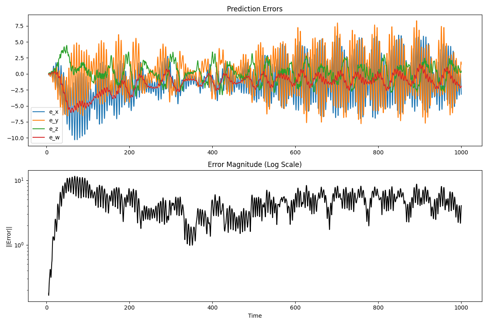

# Chaotic UMO LSTM

This project models and predicts the behavior of a chaotic system using an LSTM (Long Short-Term Memory) neural network. The system is based on a set of differential equations, and the pipeline includes solving the equations numerically, training an LSTM model, and visualizing the results.

## Project Structure

```
Chaotic_UMO_LSTM/
├── config.py               # Configuration file for system and LSTM parameters
├── train_predict.py        # Main script for solving, training, and predicting
├── visualize.py            # Script for generating plots
├── data/                   # Directory for storing numerical solutions and predictions
├── models/                 # Directory for storing trained models
├── plots/                  # Directory for storing generated plots
├── requirements.txt        # Python dependencies
└── README.md               # Project documentation
```

## Workflow

1. **Solve the UMO System**  
   The chaotic system is solved numerically using the `solve_ivp` function from `scipy`. The solution is saved in `data/umo_solution.npy`.

2. **Train the LSTM Model**  
   The LSTM model is trained on the numerical solution to predict future states of the system. The trained model is saved in `models/lstm_model.h5`.

3. **Generate Predictions**  
   The trained model is used to predict the system's behavior, and the predictions are saved in `data/predictions.npy`.

4. **Visualize Results**  
   The `visualize.py` script generates plots to compare the actual and predicted values, as well as the prediction errors.

## Installation

1. Clone the repository:
   ```bash
   git clone https://github.com/Only1JohnN/CHAOTIC_UMO_LSTM.git
   cd Chaotic_UMO_LSTM
   ```

2. Install dependencies:
   ```bash
   pip install -r requirements.txt
   ```

## Usage

Run the main pipeline:
```bash
python train_predict.py
```

This will:
- Solve the UMO system.
- Train the LSTM model.
- Generate predictions.
- Save visualizations in the `plots/` directory.

## Visualizations

### Time Series Plots
The following plot shows the actual vs. predicted values for the system variables (`x`, `y`, `z`, `w`):


### Prediction Errors
The following plots show the prediction errors and their magnitude (log scale):



### Training History
The training and validation loss during model training:


## Configuration

The system and LSTM parameters can be adjusted in `config.py`. Key parameters include:
- **UMO System Parameters**: Initial state, time span, and system constants (`a`, `b`, `c`, `d`).
- **LSTM Parameters**: Window size, train-test split, number of epochs, batch size, and LSTM units.

## Requirements

The project requires Python 3.8+ and the dependencies listed in `requirements.txt`.

## License

This project is licensed under the MIT License. See the LICENSE file for details.

## Acknowledgments

- The UMO system is inspired by chaotic systems in dynamical systems theory.
- The LSTM model is implemented using Keras and TensorFlow.
```

Make sure to replace `<repository-url>` with the actual URL of your repository. Also, ensure the plots are generated and saved in the plots directory before using the README.